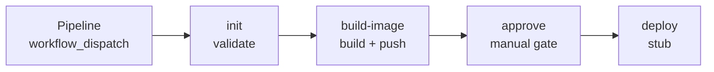

# attogen-deployment-util

A standalone deployment orchestrator for attogen's services. Dispatched
with a target repo, branch, service, and environment, it fetches that
source, runs its test suite, builds and pushes a container image, pauses
for manual approval, and deploys — one linear pipeline, each stage a
separate reusable workflow.

It lives in its own repo on purpose: it only ever reads the target repo,
through a narrowly scoped token, and never writes back to it. Nothing here
touches attogen's own history, branches, or CI.

Scope today is attogen's `converter`, `pipeline`, and `minio` services,
deployed to k3s. Inputs are plain strings rather than a fixed enum, so
other repos, services, or environments aren't structurally ruled out — but
this is the only combination actually built and exercised so far.

## Pipeline



| Stage | File | Status |
|---|---|---|
| Pipeline | `pipeline.yml` | Orchestrator — the only `workflow_dispatch` entry point |
| init | `init.yml` | Real — fetches the target repo, runs its test suite |
| build-image | `build-image.yml` | Real — builds and pushes to `ghcr.io/attom-ai/forgen`; push is blocked until this repo's owner is granted GHCR access to that package |
| approve | `approve.yml` | Real — pauses on a GitHub Environment's required reviewers |
| deploy | `deploy.yml` | Stub — echoes only; will need a self-hosted runner reaching the cluster |

Each stage after `Pipeline` is a reusable workflow (`on: workflow_call`) —
none of them are dispatched directly.

## Usage

```bash
gh workflow run Pipeline -R <owner>/attogen-deployment-util \
  -f repo=Attom-AI/attogen -f branch=QA -f service=pipeline -f environment=k3s
```
