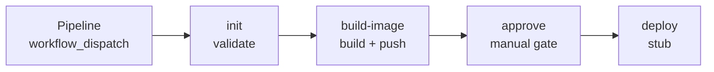

# attogen-deployment-util

Standalone deployment orchestrator: pick a target repo, branch, and
environment; deploys without modifying the target repo.

## Pipeline



| Stage | File | Status |
|---|---|---|
| Pipeline | `pipeline.yml` | Orchestrator — the only `workflow_dispatch` entry point |
| init | `init.yml` | Real — fetches the target repo, runs its test suite |
| build-image | `build-image.yml` | Real — builds and pushes to `ghcr.io/attom-ai/forgen`; push is blocked until `ezekiel-atl` is granted GHCR access on that package |
| approve | `approve.yml` | Real — pauses on a GitHub Environment's required reviewers |
| deploy | `deploy.yml` | Stub — echoes only; will need a self-hosted runner reaching the cluster |

Each stage after `Pipeline` is a reusable workflow (`on: workflow_call`) —
none of them are dispatched directly.

## Usage

```bash
gh workflow run Pipeline -R ezekiel-atl/attogen-deployment-util \
  -f repo=Attom-AI/attogen -f branch=QA -f service=pipeline -f environment=k3s
```
